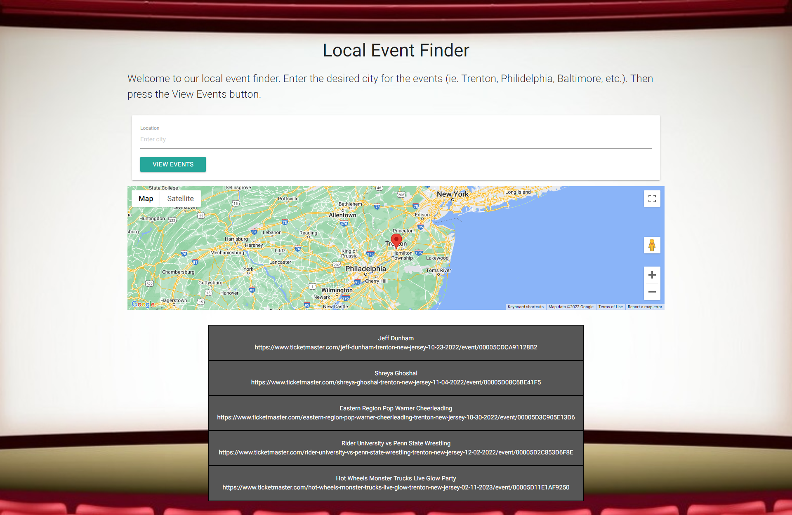
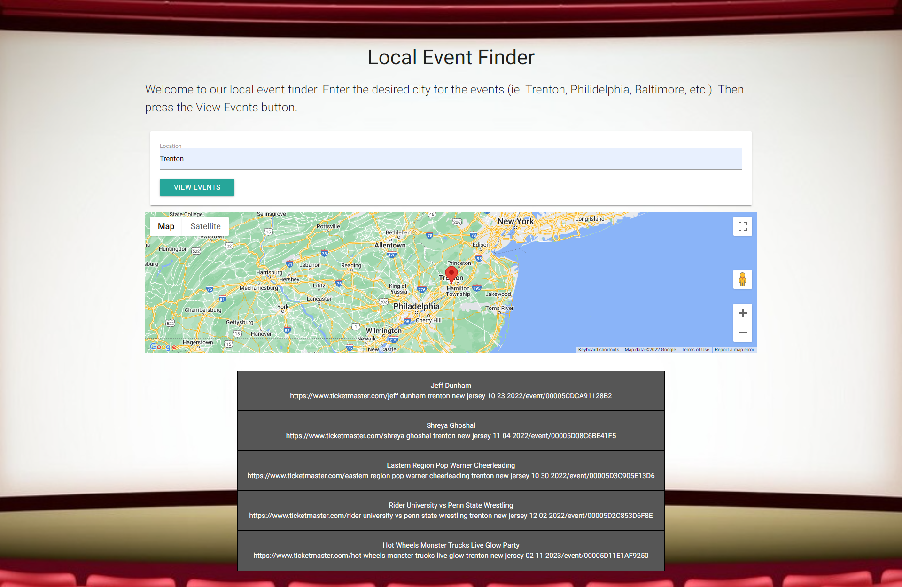

# Rutgers Bootcamp Project 1 Group #3- Event Finder "Find your Fun!"

## Description

We created a easy-to-use tool to help you enjoy your free time!

It’s a local event finder called “Find your Fun!”.  

First, select the type of event you want to enjoy, which can be sports, concerts or comedy shows.

Next, enter the city in which you would like to attend the event.  
Press the View Events button and Voila!  A map of the area and events in that location appear before your eyes!

## USER STORY

As a person with free time 
I WANT to view a website that shows local sports events, concerts and comedy shows 
SO THAT I can select an event to attend 

## Technologies Used

We used the VS Code software to edit code, git and git branches to work on the code among our group and pull code to our local machines and then git again to push our final versions from our branches to the GitHub main branch.  

We used the following technologies: 
*Server-side APIs: Ticketmaster for events and Google Maps for the maps 
*CSS framework: Materialize 
*HTML 
*CSS 
*JavaScript 
*VS Code 
*Git/GitHub 
*persistent data/local storage 

This website is responsive, including the background image.

## Usage

Here's a link to the deployed website in GitHub:

https://cbinder705.github.io/TBA-Event-Finder/

Here are 2 screenshots of the website:
    

    

    
    
## Credits
N/A

## License

As this is a class project, no license is needed.

## Badges

N/A

## Features

The main features of this website allow people to select the type of event they want to look up from either Sports, Concerts or Comedy Shows.  They also enter the location where they want to go to the event.  Then they push a View Events button that causes a Google Map, events list and previous event searches to be displayed at the bottom of the page.

## How-to-Contribute

N/A

## Tests

We tested this website as a team as to ensure proper functionality.