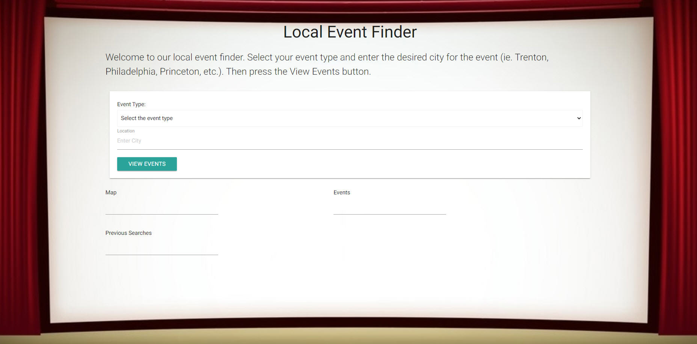
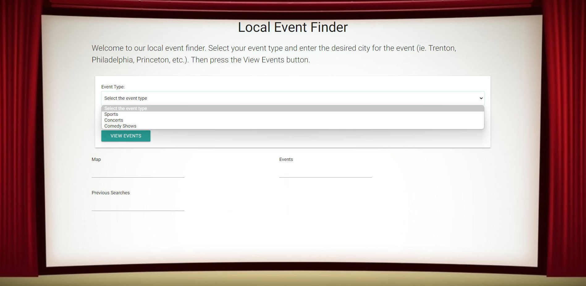

# Rutgers Bootcamp Project 1 Group #3- Event Finder "Find your Fun!"

## Description

We created a easy-to-use tool to help you enjoy your free time!

It’s a local event finder called “Find your Fun!”.  

First, Enter the state where you live or where you will be.  
Press the View Events button and Voila!  A map of the area and events in that location appear before your eyes!

## USER STORY

As a user 
I WANT to view a website that shows local sports 
SO THAT I can attend an event during my free time 

## Technologies Used

We used the VS Code software to edit code, git and git branches to work on the code among our group and pull code to our local machines and then git again to push our final versions from our branches to the GitHub main branch.  

We also used Server-side APIs: Ticketmaster for events, XXXXX for XXX, CSS framework: Materialize, HTML, CSS, JavaScript, VS Code, Git/GitHub and persistent data/local storage to retrieve past event searches.  This website is responsive, including the background image.

## Usage

Here's a link to the deployed website in GitHub:

https://cbinder705.github.io/TBA-Event-Finder/

Here are 2 screenshots of the website:
    

    

    
## Credits
N/A

## License

As this is a class project, no license is needed.

## Badges

N/A

## Features

The main features of this website allow people to view local Sport events.  They also enter the location where they want to go to the event.  Then they push a View Events button that causes a Google Map and local events to be displayed at the bottom of the page.

## How-to-Contribute

N/A

## Tests

We tested this website as a team as to ensure proper functionality.
